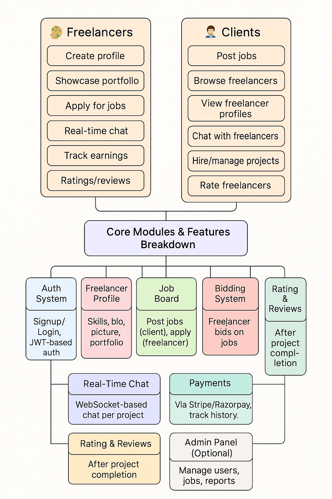

## Sections

- [Project Overview](#what-is-freelancersphere)
- [Environment Setup](./env_setup/environmental_setup.md)
- [Architecture](./backend_architecture/folder_structure.md)
- [MongoDB Connection](./backend_architecture/mongodb_connection.md)
- [Authentication Flow](./auth/auth_module.md)
- [API Reference](./auth/auth_module.md/#jwt-token---what--why)
- [Common Errors](./auth/auth_module.md/#common-errors)
- [GitHub Workflows](./github_workflows/gh_workflows.md)

---

## What is FreelancerSphere

A freelancing ecosystem where freelancers can:
- Build and showcase portfolios
- Connect with clients
- Apply for jobs
- Chat in real-time
- Get paid
- Build reputation (ratings, reviews)

--- 

## User Roles 
### Freelancers
    - Create profile
    - Showcase portfolio
    - Apply for jobs
    - Real-time chat
    - Track earnings
    - Ratings/ reviews

### Clients
    - Post jobs
    - Browse freelancers
    - View freelancers profiles
    - Chat with freelancers
    - Hire/manage projects
    - Rate freelancers

--- 

## Core Modules & features
- Auth system: Signup/Login, JWT based auth
- Freelancer Profile: Skills, bio, picture, portfolio
- Portfolio Upload: Upload PDFs, images, links, GitHub
- Job Board: Post jobs (client), apply(freelancer)
- Bidding System: Freelancer bids on jobs
- Real-Time Chat: WebSocket-based chat per project
- Payments: Via Stripe/Rozarpay, track history
- Rating & Reviews: After project completion
- Admin Panel(yet to be decided): Manage users, jobs, reports

---

## Modules Breakdown

  

*Fig: FreelancerSphere Modules Breakdown*

## Contributing
# How to create a PR
1. Fork the repository
2. Create a branch: `git checkout -b feature-name`
3. Commit changes: `git commit -m "Add feature xyz"`
4. Push: `git push origin feature-name`
5. Open a PR

Our workflow will automatically check your PR and give feedback!
